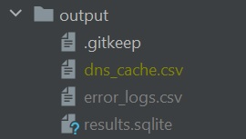
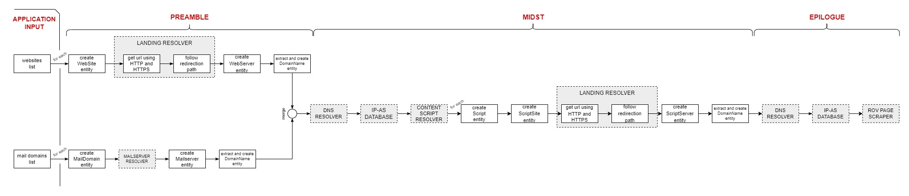
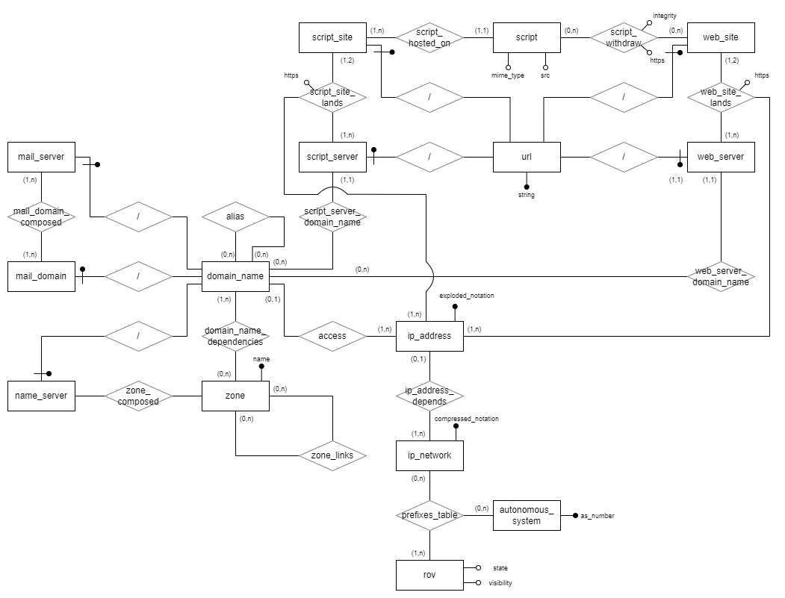

# LavoroTesi
## Python setup
The python version used to develop this software is 3.8
The package manager(pip) version used is 21.2.2

The python modules imported in this project:

```
dns
csv
pathlib
re
selenium
seleniumwire
ipaddress
requests
gzip
peewee
```

Make sure your python interpreter has all of them.
Probably the only modules to install for default environments are: dnspython (version >= 2.0.0), selenium, 
selenium-wire and peewee.
So you can install every one of them using pip (if present in the environment):

```
pip install dnspython==2.1.0
pip install selenium
pip install selenium-wire
pip install peewee
```

You can install them all using one command:

```
pip install selenium selenium-wire dnspython==2.1.0 peewee
```

## Configuration
The application uses 2 vital folders: the 'input' folder used to contain all the necessary files to function
(described later), and the 'output' folder that contains the results of an execution gone well.
Both folders are created in the project root directory (PRD): LavoroTesi.

To configure the application you have to:
1) Use Windows as OS
2) Have Firefox installed
3) Download geckodriver (https://github.com/mozilla/geckodriver/releases) and put the executable file in the
input folder of the application

Also, the application needs the .tsv database taken from https://iptoasn.com/ (in the 'input' folder) but
it is controlled by the application itself, and if it is absent (or updated less than an hour ago) it will be
downloaded, extracted and replaced automatically.
Obviously you can copy such database in the folder manually.

## Configuration: input folder
The input folder is a directory contained in the project root directory (PRD) named 'input'.
This folder's purpose is to contain all the necessary "tools" to make the application work.
The expected tools' list is:

1) the geckodriver executable file (not the archive); you can name this file whatever you want as long it is a
.exe file
2) the network number database (.tsv file); you can name this file whatever you want as long it is a .tsv file
3) OPTIONAL: a .txt file containing all the domain names you want to use as input, one per line;
you can name this file whatever you want as long it is a .txt file
4) just for application' safety it is present a .gitkeep file. Do not modify/delete this file.


## Configuration: output folder
The output folder is a directory contained in the project root directory (PRD) named 'output'.
This folder's purpose is to contain all the results (as files) from the execution of the application.
The expected result files are:

1) a .csv file named 'cache.csv' containing the entire cache from the DNS resolver. This file automatically is loaded
when starting the DNS cache here in the output folder; if there isn't then cache starts empty.
2) a .csv file named 'error_logs.csv' containing all the registered errors encountered during the entire elaboration of
the application
3) a .sqlite file named 'results.sqlite' containing all the application data registered during its
elaboration using the E-R schema presented further in this Readme.md file
4) just for application' safety it is present a .gitkeep file. Do not modify/delete this file.



## How to run
The application starts executing the main.py file.
The only application input/argument is a list of domain name. You can set them in 2 ways:
1) via command line
2) via a .txt file put in the input folder, one domain name for line

If no domain name is set as argument, the application will start using a default list of 2 domain names to show its behaviour:
```
google.it
youtube.it
```

## Snapshot exception mechanism
If an unwanted exception occurs, the application will notice that and will take a snapshot of the initial state of
the execution to be studied/resolved later. It will create a sub-folder (relative to the SNAPSHOTS folder) using
the current timestamp (as name) containing:
1) a .csv file of the cache before the actual elaboration occurred
2) a .txt file containing the final domain name list
3) a .txt containing the type of the exception, the result of the str(.) method used on the exception and the traceback
object print

## Execution results
The final state of the DNS cache will be exported as .csv file, and so will be the DNS error logs. Everything will be
put in the 'output' folder.
Results of each entity are saved in the sqlite database put in the 'output' folder with name: 'results.sqlite' .

The ER schema of such database is shown at the end of this readme file.

The application can be seen as a block diagram:


The expected prints during its execution of each component are:

DnsResolver:
```
START DNS DEPENDENCIES RESOLVER
Cache has 395 entries.
Looking at zone dependencies for 'google.it'..
Depends on zone: .    [NON-AUTHORITATIVE]
Depends on zone: it.
Depends on zone: google.it.
Depends on zone: net.    [NON-AUTHORITATIVE]
Depends on zone: root-servers.net.    [NON-AUTHORITATIVE]
Depends on zone: nic.it.
Depends on zone: dns.it.
Depends on zone: cnr.it.
Depends on zone: com.    [NON-AUTHORITATIVE]
Depends on zone: google.com.    [NON-AUTHORITATIVE]
Depends on zone: gtld-servers.net.    [NON-AUTHORITATIVE]
Depends on zone: ge.cnr.it.
Depends on zone: nstld.com.    [NON-AUTHORITATIVE]
Depends on zone: ieiit.cnr.it.
Dependencies recap: 14 zones, 19 cache entries added, 0 errors.

[...]

END DNS DEPENDENCIES RESOLVER
```

IpAsDatabase:
```
START IP-AS RESOLVER
Handling domain[0] 'google.it'
--> Handling zone[0] '.'
----> for nameserver[0] 'a.root-servers.net.' (198.41.0.4) found AS396574: [198.41.0.0 - 198.41.0.255]. Belonging network: 198.41.0.0/24
----> for nameserver[1] 'b.root-servers.net.' (199.9.14.201) found AS394353: [199.9.14.0 - 199.9.15.255]. Belonging network: 199.9.14.0/23
----> for nameserver[2] 'd.root-servers.net.' (199.7.91.13) no AS found.
----> for nameserver[3] 'l.root-servers.net.' (199.7.83.42) no AS found.
----> for nameserver[4] 'j.root-servers.net.' (192.58.128.30) found AS26415: [192.58.128.0 - 192.58.128.255]. Belonging network: 192.58.128.0/24
----> for nameserver[5] 'k.root-servers.net.' (193.0.14.129) found AS25152: [193.0.14.0 - 193.0.15.255]. Belonging network: 193.0.14.0/23
----> for nameserver[6] 'f.root-servers.net.' (192.5.5.241) no AS found.
----> for nameserver[7] 'h.root-servers.net.' (198.97.190.53) found AS1508: [198.97.190.0 - 198.97.190.255]. Belonging network: 198.97.190.0/24
----> for nameserver[8] 'c.root-servers.net.' (192.33.4.12) no AS found.
----> for nameserver[9] 'g.root-servers.net.' (192.112.36.4) found AS5927: [192.112.36.0 - 192.112.36.255]. Belonging network: 192.112.36.0/24
----> for nameserver[10] 'e.root-servers.net.' (192.203.230.10) found AS21556: [192.203.230.0 - 192.203.230.255]. Belonging network: 192.203.230.0/24
----> for nameserver[11] 'm.root-servers.net.' (202.12.27.33) found AS7500: [202.12.27.0 - 202.12.27.255]. Belonging network: 202.12.27.0/24
----> for nameserver[12] 'i.root-servers.net.' (192.36.148.17) found AS29216: [192.36.148.0 - 192.36.149.255]. Belonging network: 192.36.148.0/23
--> Handling zone[1] 'it.'
----> for nameserver[0] 'dns.nic.it.' (192.12.192.5) no AS found.
----> for nameserver[1] 'm.dns.it.' (217.29.76.4) no AS found.

[...]

END IP-AS RESOLVER
```

finding landing_page:
```
START LANDING PAGE RESOLVER

Trying to connect to domain 'google.it' via https:
URL deducted: google.it ---> https://google.it/
Landing url: https://consent.google.it/ml?continue=https://www.google.it/&gl=IT&m=0&pc=shp&hl=it&src=1
HTTP Strict Transport Security: False
Redirection path:
[1/3]: https://google.it/
[2/3]: https://www.google.it/
[3/3]: https://consent.google.it/ml?continue=https://www.google.it/&gl=IT&m=0&pc=shp&hl=it&src=1

[...]

END LANDING PAGE RESOLVER
```

ContentDependenciesResolver:
```
START CONTENT DEPENDENCIES RESOLVER
Searching content dependencies for: https://consent.google.it/ml?continue=https://www.google.it/&gl=IT&m=0&pc=shp&hl=it&src=1
--> [1]: tracking-protection.cdn.mozilla.net	https://tracking-protection.cdn.mozilla.net/ads-track-digest256/94.0/1637071485	200	application/octet-stream
--> [2]: tracking-protection.cdn.mozilla.net	https://tracking-protection.cdn.mozilla.net/social-track-digest256/94.0/1637071485	200	application/octet-stream
--> [3]: tracking-protection.cdn.mozilla.net	https://tracking-protection.cdn.mozilla.net/analytics-track-digest256/94.0/1637183081	200	application/octet-stream
--> [4]: tracking-protection.cdn.mozilla.net	https://tracking-protection.cdn.mozilla.net/content-track-digest256/94.0/1637071485	200	application/octet-stream
--> [5]: tracking-protection.cdn.mozilla.net	https://tracking-protection.cdn.mozilla.net/mozstd-trackwhite-digest256/94.0/1637071485	200	application/octet-stream
--> [6]: tracking-protection.cdn.mozilla.net	https://tracking-protection.cdn.mozilla.net/google-trackwhite-digest256/94.0/1637071485	200	application/octet-stream
--> [7]: consent.google.it	https://consent.google.it/ml?continue=https://www.google.it/&gl=IT&m=0&pc=shp&hl=it&src=1	303	application/binary
--> [8]: www.gstatic.com	https://www.gstatic.com/og/_/js/k=og.qtm.en_US.IF_nEUVbySA.O/rt=j/m=qabr,q_dnp,qcwid,qapid,qald/exm=qaaw,qadd,qaid,qein,qhaw,qhbr,qhch,qhga,qhid,qhin,qhpr/d=1/ed=1/rs=AA2YrTt627FYKdH2GK-BgEU4PuYwjLcuGA	200	text/javascript; charset=UTF-8
--> [9]: apis.google.com	https://apis.google.com/_/scs/abc-static/_/js/k=gapi.gapi.en.R9QuLJE0V3o.O/m=gapi_iframes,googleapis_client/rt=j/sv=1/d=1/ed=1/rs=AHpOoo9DhQIvUvbE3v8eEhVx9XQkrkVYIQ/cb=gapi.loaded_0	200	text/javascript; charset=UTF-8

[...]

END CONTENT DEPENDENCIES RESOLVER
```

If there are new domain names, will be printed:
```

NEW DOMAIN NAME[1/4]: tracking-protection.cdn.mozilla.net
NEW DOMAIN NAME[2/4]: consent.google.it
NEW DOMAIN NAME[3/4]: www.gstatic.com
NEW DOMAIN NAME[4/4]: apis.google.com

```
and the prints will start again from the DnsResolver with the new domain names.

Otherwise:
```

NO NEW DOMAIN NAME.

```

ROVPageScraper:
```
START ROV PAGE SCRAPING
Loading page for AS396574
!!! No table found in ROV page for AS number '396574'. !!!
!!! No table found in ROV page for AS number '396574'. !!!
!!! No table found in ROV page for AS number '396574'. !!!
!!! No table found in ROV page for AS number '396574'. !!!
Loading page for AS394353
--> for 'b.root-servers.net.' (199.9.14.201), found row: [AS394353	199.9.14.0/23	0	US	9	UNK	]
Loading page for AS26415
!!! No network found for address 192.58.128.30. !!!
Loading page for AS25152
--> for 'k.root-servers.net.' (193.0.14.129), found row: [AS25152	193.0.14.0/23	256	NL	10	VLD	[Addr:193.0.14.0/23,Max:23,AS:25152]]
Loading page for AS1508
--> for 'h.root-servers.net.' (198.97.190.53), found row: [AS1508	198.97.190.0/24	256	US	10	UNK	]
Loading page for AS5927
--> for 'g.root-servers.net.' (192.112.36.4), found row: [AS5927	192.112.36.0/24	256	US	9	UNK	]
Loading page for AS21556
--> for 'e.root-servers.net.' (192.203.230.10), found row: [AS21556	192.203.230.0/24	256	US	10	UNK	]

[...]

END ROV PAGE SCRAPING
```

The database result ER schema is:


Every entity has an implicit numerical primary key.  